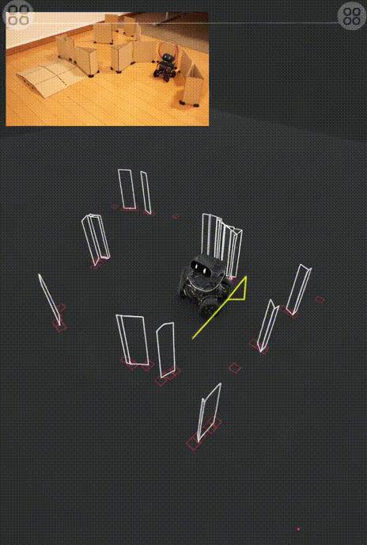
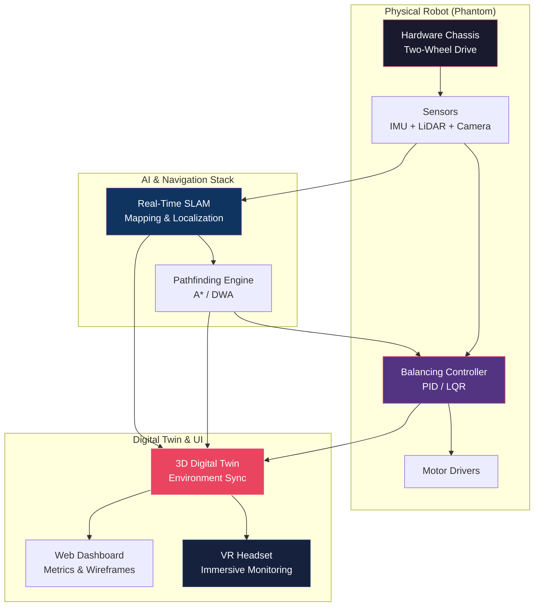

<div align="center">


# PHANTOM ROBOT

<<<<<<< HEADsa
### Advanced Two-Wheeled Self-Balancing Autonomous Robot

=======
>>>>>>> f8f0b53353144fcc6f9398bf255aed67341ad133
[](LICENSE)
[](https://python.org)
[](https://isocpp.org)
[](https://docs.ros.org/en/humble/)
[](https://PhantomRobot.github.io/phantom-robot)

**A cutting-edge platform demonstrating the seamless integration of physical hardware and Artificial Intelligence through real-time Digital Twin technology.**

[Overview](#overview) · [Key Technologies](#key-technologies) · [Physical Design](#physical-design) · [Demos](#demo-videos) · [Scenarios](#scenarios-plot) · [Metrics](#metrics-plot) · [Architecture](#system-architecture) · [Getting Started](#getting-started)

---

</div>

## Overview

**Phantom** is an advanced two-wheeled self-balancing autonomous robot designed specifically to showcase the next generation of hardware-AI integration. The core strength of Phantom lies in its ability to navigate complex environments autonomously while simultaneously projecting its entire state and movement into a real-time 3D Digital Twin simulation.

Whether navigating through a cardboard maze or tracking a specific target, Phantom maintains perfect balance while providing operators with an immersive, data-rich monitoring experience.

<div align="center">
  
  
</div>

---

## Key Technologies & Specifications

Phantom integrates several state-of-the-art robotics and AI technologies into a single cohesive platform:

| Technology | Description |
|------------|-------------|
| **Self-Balancing System** | Moves and stands upright using only two wheels with extreme precision. Powered by an advanced control system that continuously calculates and adjusts the robot's center of gravity. |
| **Real-Time SLAM** | Autonomous mapping and navigation system capable of instantly detecting obstacles (such as maze walls) and generating accurate spatial maps on the fly. |
| **Intelligent Pathfinding** | Automatically calculates and executes the most efficient route to a target (e.g., a green ball). The planned trajectory is visually represented as yellow dotted lines within the system. |
| **Digital Twin Integration** | Features a real-time monitoring interface that displays a 3D simulation of both the robot and its physical environment (rendered as white wireframes), allowing for accurate tracking of metrics and paths. |
| **VR Interaction Support** | Designed to be monitored and interacted with directly by users wearing Virtual Reality (VR) headsets, creating a highly immersive showcase experience. |

---

## Physical Design

The physical construction of Phantom is engineered for both aesthetics and high-performance mobility:

- **Form Factor**: Compact, multi-layer chassis design with an elegant matte black finish.
- **Mobility**: Features a **zero turning radius** thanks to its two-wheeled differential drive system, allowing it to maneuver effortlessly in extremely tight spaces.
- **Identity**: Proudly displays a custom "PHANTOM" nameplate mounted on the front/lower section of the chassis.

---

## Demo Videos

Real-world demonstrations of Phantom deployed in various scenarios. These videos showcase the platform's capabilities across different control modalities and environments.

### Autonomous Navigation & Balancing

<div align="center">
<video src="media/demo_whole_body.mp4" width="80%" controls></video>
</div>

> Demonstration of Phantom's core self-balancing capability while autonomously navigating through a complex environment. The control system maintains perfect stability despite dynamic movements.

### VR Teleoperation & Digital Twin

<div align="center">
<video src="media/demo_teleop_vr.mp4" width="80%" controls></video>
</div>

> Real-time interaction via VR headset. The operator can view the 3D Digital Twin environment and control the robot with sub-100ms latency, enabling intuitive and immersive teleoperation.

### Pathfinding & Target Tracking

<div align="center">
<video src="media/demo_walking_control.mp4" width="80%" controls></video>
</div>

> Phantom executing intelligent pathfinding to reach a designated target. The system dynamically recalculates the optimal route while avoiding newly introduced obstacles.

---

## Scenarios Plot

The following 3D trajectory plots visualize Phantom's planned path (blue) versus actual executed path (red) across different navigation scenarios. Start and end points are annotated with coordinates.

### Maze Navigation Trajectory

<div align="center">

</div>

> Phantom navigating through a cardboard maze. The planned path closely matches the executed trajectory with minimal drift across 3.77 m of forward travel.

### High-Speed Obstacle Avoidance

<div align="center">

</div>

> High-speed navigation with dynamic obstacle avoidance. The pathfinding engine recalculates routes in real-time while maintaining tracking fidelity over 11+ meters.

### Vertical Stability During Transitions

<div align="center">

</div>

> Vertical center-of-mass trajectory during speed transitions (stop-to-move and move-to-stop). The balancing controller accurately maintains height stability with minimal Z-axis drift.

---

## Metrics Plot

Detailed performance metrics from Phantom's control system evaluation across multiple test runs.

### Position Tracking Error

<div align="center">

</div>

> Position and velocity tracking errors converge to near-zero within the first 5 seconds of each run, demonstrating rapid adaptation and stable control.

### Angular Velocity & Center of Mass Height

<div align="center">

</div>

> The base angular velocity converges from 0.18 rad/s to near-zero within 4 seconds. Center-of-mass height stabilizes within the tolerance band around the 0.75 m target.

### Training Reward Curves

<div align="center">

</div>

> Reward components during balancing policy training. Total reward saturates around 0.85, with position tracking contributing the largest share.

### Benchmark: Success Rate by Navigation Scenario

<div align="center">

</div>

> Phantom's AI navigation stack consistently outperforms the baseline controller across all 11 test scenarios, achieving 97.2% on standard maze navigation and maintaining >70% even on challenging dynamic obstacle courses.

---

## System Architecture



---

## What's Included

```
phantom-robot/
├── phantom_sonic/              # Core Python package for AI and control
│   ├── core/                    #   Balancing policy, network, config
│   ├── teleop/                  #   VR, keyboard, gamepad controllers
│   ├── utils/                   #   Transforms, ZMQ, robot definitions
│   └── configs/                 #   Deployment and teleop YAML configs
├── phantom_sonic_deploy/       # C++ deployment stack for real-time control
│   ├── include/phantom_sonic/  #   Header files (inference, safety, state)
│   ├── src/                     #   Implementation files
│   └── CMakeLists.txt           #   Build configuration
├── docs/                        # Full documentation
├── tests/                       # Comprehensive test suite
├── media/                       # Visual assets and demo videos
├── pyproject.toml               # Python package configuration
├── Makefile                     # Build system entry point
└── LICENSE                      # Apache 2.0 License
```

---

## Getting Started

### Prerequisites

| Requirement | Version |
|-------------|---------|
| Python | 3.8+ |
| ROS2 | Humble (Recommended) |
| CMake | 3.16+ (C++ deployment only) |

### Installation

```bash
# Clone the repository
git clone https://github.com/PhantomRobot/phantom-robot.git
cd phantom-robot

# Install Python package
pip install -e .

# With all optional dependencies (VR, UI)
pip install -e ".[dev,deploy,teleop]"
```

### Quick Start

```python
from phantom_sonic import PhantomController, PhantomConfig

# Configure and load the balancing policy
config = PhantomConfig(mode="autonomous", enable_digital_twin=True)
robot = PhantomController(config=config)
robot.initialize()

# Start the main control loop
robot.start_balancing()
robot.enable_slam()

# Set a target for pathfinding
robot.navigate_to(target_x=2.5, target_y=1.0)
```

---

## License

This project is licensed under the [Apache License 2.0](LICENSE).

All required legal documents, including 3rd-party attributions and DCO language, are consolidated in the [`/legal`](legal/) folder.

---

## Support

For questions and issues, please [open an issue](https://github.com/PhantomRobot/phantom-robot/issues) or contact the Phantom Robot team.

<div align="center">

---

**Phantom Robot** — *Bridging the physical and digital worlds.*


</div>
