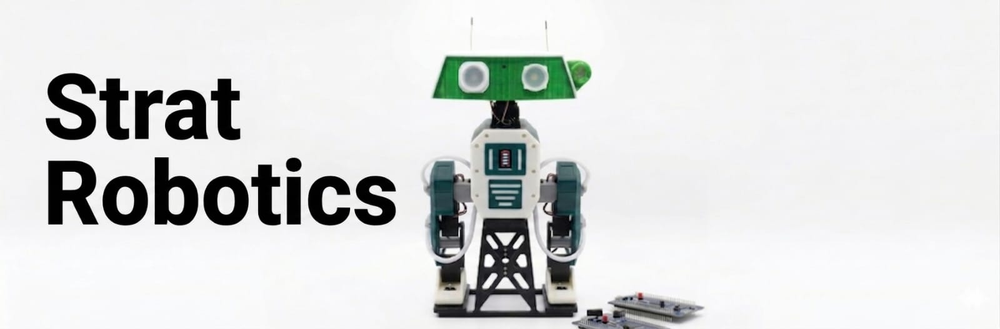
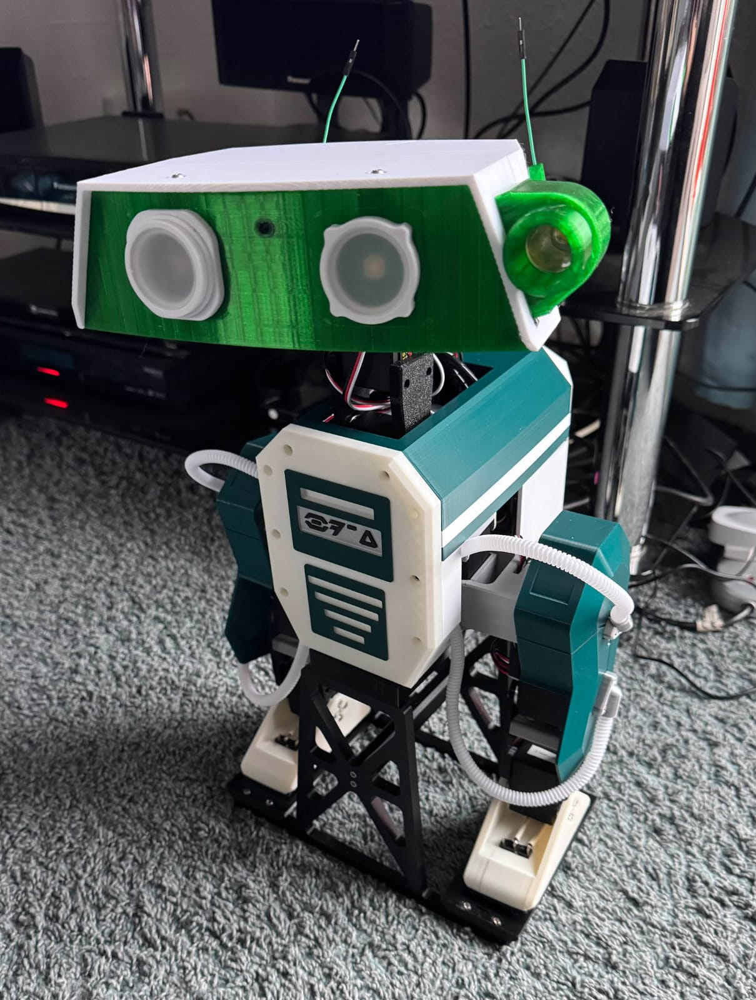
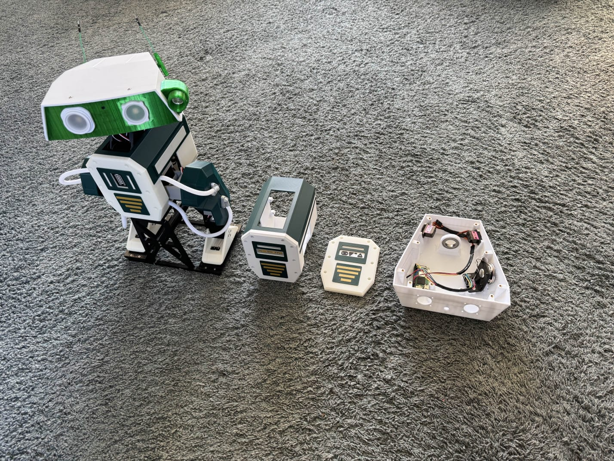
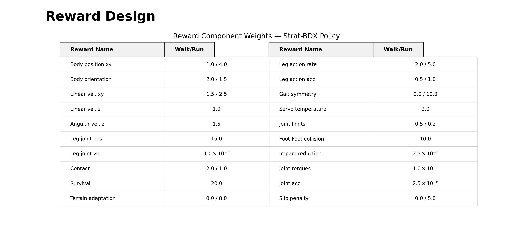
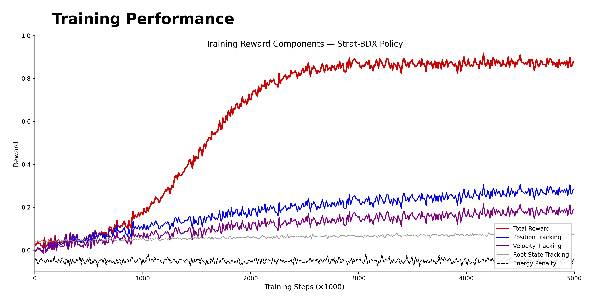
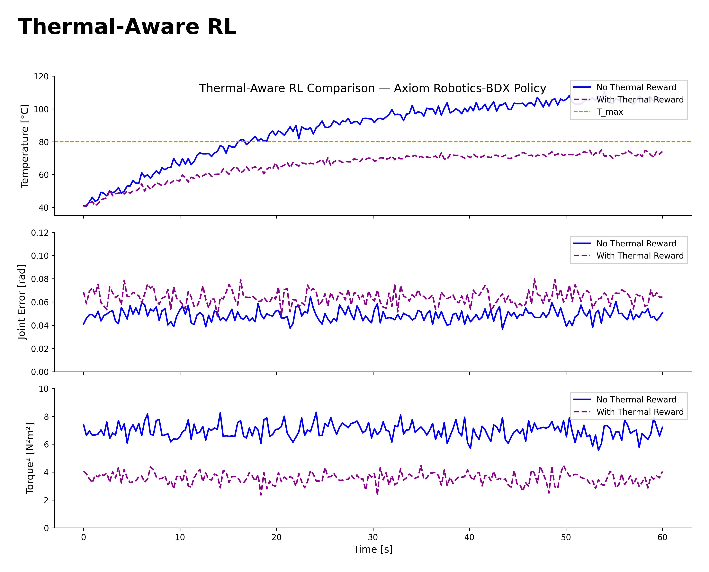
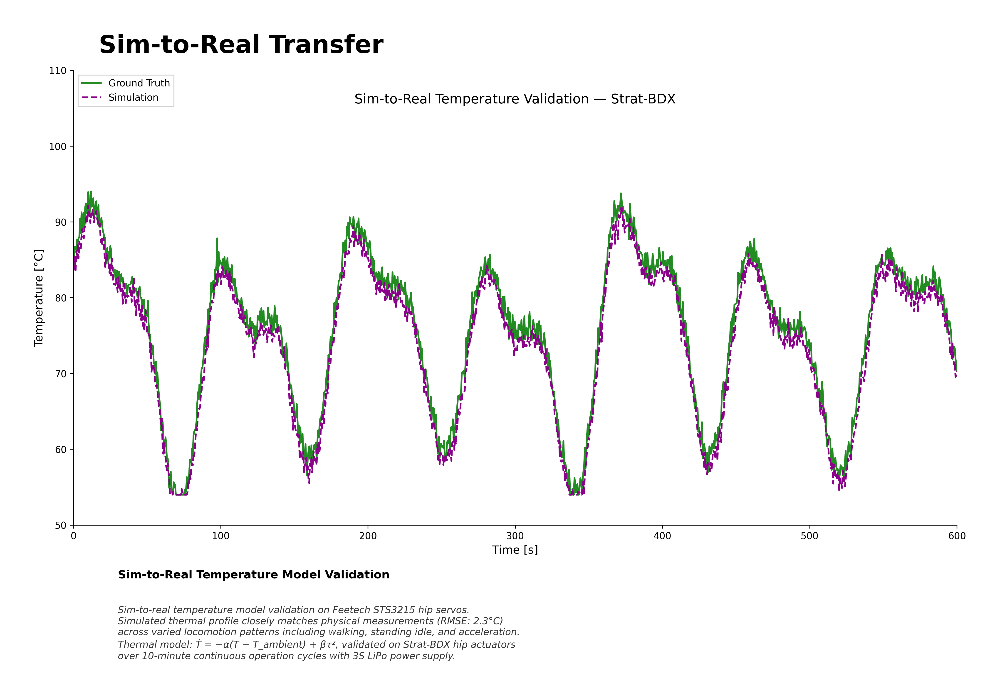

# Strat Robotics


<p align="center">
  
</p>

<p align="center">
  <strong>Autonomous Bipedal Robot Platform with Reinforcement Learning</strong>
</p>

<p align="center">
  <a href="https://discord.gg/UtJZsgfQGe">
    
  </a>
  
  
  
</p>

---

## Overview

Strat Robotics is an open-source autonomous bipedal robot platform inspired by the iconic BDX droid from Disney. Standing at approximately 42 centimeters tall with legs extended, this project demonstrates the intersection of mechanical design, embedded systems, and reinforcement learning.

### Key Features

- **Autonomous Walking**: PPO/SAC-trained policies for stable bipedal locomotion
- **Sim-to-Real Transfer**: Physics-accurate MuJoCo simulation with real-world deployment
- **ESP32-C3 Control**: Low-latency embedded motor control
- **ONNX Policy Export**: Runtime-agnostic neural network inference
- **Expression System**: LED eyes, speaker, and microphone integration

---

## Visual Overview

<p align="center">
  
  
</p>

---

## Robot Specifications

| Parameter | Specification |
|-----------|---------------|
| Height | ~42 cm (legs extended) |
| DOF | 12 (6 per leg) |
| Actuators | Feetech STS/STSeries servos |
| Onboard Computer | Raspberry Pi Zero 2W |
| Microcontroller | ESP32-C3 |
| Total Cost | < $400 |

---

## Project Structure

```
Strat-Robotics/
├── strat_bdx/              # Robot CAD and URDF models
│   ├── cad/                # OnShape exports
│   ├── urdf/               # Robot description
│   └── meshes/             # STL/OBJ meshes
├── experiments/            # RL training and experiments
│   ├── mujoco/             # MuJoCo simulation environment
│   ├── RL/                 # Training scripts (PPO/SAC)
│   └── real_robot/          # Real-world testing
├── docs/                   # Documentation
│   ├── assembly_guide.md   # Assembly instructions
│   ├── print_guide.md      # 3D printing settings
│   └── sim2real.md         # Sim-to-real transfer guide
├── print/                  # 3D printable STL files
├── BEST_WALK_ONNX.onnx     # Pre-trained walking policy
└── BEST_WALK_ONNX_2.onnx   # Alternative walking policy
```

---

## Quick Start

### 1. Hardware Assembly

Follow the [Assembly Guide](docs/assembly_guide.md) for complete build instructions.

### 2. Software Setup

```bash
# Clone the repository
git clone https://github.com/yourusername/Strat-Robotics.git
cd Strat-Robotics

# Install dependencies
pip install -e .
```

### 3. Run Pre-trained Policy

```bash
python experiments/mujoco/v2_rl_walk_mujoco.py --onnx_model_path BEST_WALK_ONNX_2.onnx
```

### 4. Train Your Own Policy

See [Sim-to-Real Guide](docs/sim2real.md) for training instructions.

---

## Reinforcement Learning

### Training Pipeline

```
┌─────────────┐     ┌──────────────┐     ┌─────────────┐
│  Reference  │────▶│   MuJoCo     │────▶│   ONNX      │
│   Motion    │     │  Simulation  │     │   Policy    │
└─────────────┘     └──────────────┘     └─────────────┘
                           │                    │
                           ▼                    ▼
                    ┌──────────────┐     ┌─────────────┐
                    │  PPO/SAC     │────▶│   ESP32-C3  │
                    │  Training    │     │   Control   │
                    └──────────────┘     └─────────────┘
```

### Supported Algorithms

- **PPO** (Proximal Policy Optimization)
- **SAC** (Soft Actor-Critic)

### Reward Design

Our multi-objective reward function balances locomotion quality, gait symmetry, thermal safety, and energy efficiency across walk and run modes. Trained with PPO in MuJoCo with 4096 parallel environments and domain randomization (mass ±10%, friction ±20%, servo delay ±5ms).

<p align="center">
  
</p>

### Training Performance

Training reward components over 5B environment steps. Total reward converges as position tracking and velocity tracking improve, while energy penalty provides constant regularization critical for STS3215 servo longevity and 3S LiPo battery life.

<p align="center">
  
</p>

### Thermal-Aware Control

The Feetech STS3215 servos generate significant heat during sustained walking, especially in hip actuators carrying the full upper-body load. With no active cooling on a sub-$400 platform, we incorporate servo temperature as a policy input and add thermal penalty rewards. The thermal-aware policy reduces torque² by ~49% at the cost of ~31% higher tracking error, keeping all servos safely below T_max = 80°C.

<p align="center">
  
</p>

---

## Embedded Runtime

The onboard runtime handles:
- Motor control via ESP32-C3
- Neural network inference on Raspberry Pi Zero 2W
- Sensor data processing
- Communication with simulation

**Runtime Repository**: [Strat Robotics Runtime](https://github.com/apirrone/Strat_Robotics_Runtime)

---

## Documentation

| Document | Description |
|----------|-------------|
| [Assembly Guide](docs/assembly_guide.md) | Complete assembly instructions |
| [Print Guide](docs/print_guide.md) | 3D printing settings and STL files |
| [Motor Configuration](docs/configure_motors.md) | Feetech servo setup |
| [Sim-to-Real Guide](docs/sim2real.md) | Training and deployment pipeline |

---

## Bill of Materials

| Component | Quantity | Est. Cost |
|-----------|----------|-----------|
| Feetech STS3215 Servo | 12 | $180 |
| ESP32-C3 DevKit | 1 | $5 |
| Raspberry Pi Zero 2W | 1 | $25 |
| 3S LiPo Battery | 1 | $20 |
| Buck Converter | 2 | $10 |
| M3 Hardware | ~100 | $15 |
| 3D Printed Parts | - | ~$50 |

**Full BOM**: [Google Sheets](https://docs.google.com/spreadsheets/d/1gq4iWWHEJVgAA_eemkTEsshXqrYlFxXAPwO515KpCJc/edit)

---

## Sim-to-Real Progress

### Thermal Model Validation

We validate our first-order thermal actuator model (Ṫ = −α(T − T_ambient) + βτ²) against physical STS3215 hip servo thermistor measurements during 10-minute continuous walking tests. The MuJoCo simulation tracks ground truth with RMSE of 2.3°C, confirming reliable thermal prediction for policy deployment.

<p align="center">
  
</p>

### Walking Policy Demo

https://github.com/user-attachments/assets/58721d0f-2f95-4088-8900-a5d02f41bba7

### Real Robot Testing

https://github.com/user-attachments/assets/4129974a-9d97-4651-9474-c078043bb182

https://github.com/user-attachments/assets/a0afcd38-15d8-40c6-8171-a619107406b8

---

## Community

Join our Discord server for help and updates:

<a href="https://discord.gg/UtJZsgfQGe">
   Join Strat Robotics Community
</a>

### Community Builds


---

## References

- **MuJoCo Playground**: [Open Duck Playground](https://github.com/apirrone/Open_Duck_Playground)
- **Reference Motion Generator**: [Open Duck Reference Motion](https://github.com/apirrone/Open_Duck_reference_motion_generator)
- **Actuator Identification**: [BAM by Rhoban](https://github.com/Rhoban/bam)
- **CAD Model**: [OnShape](https://cad.onshape.com/documents/64074dfcfa379b37d8a47762/w/3650ab4221e215a4f65eb7fe/e/0505c262d882183a25049d05)

---

## Acknowledgments

Special thanks to:

- **HuggingFace** for sponsoring this project
- **Pollen Robotics** for open-source robotics tools
- **Rhoban** for actuator modeling tools

---

## License

MIT License - See [LICENSE](LICENSE) for details.

---

