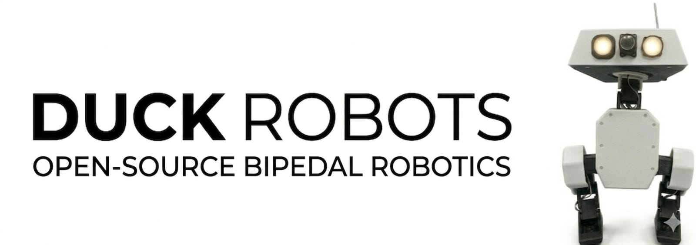
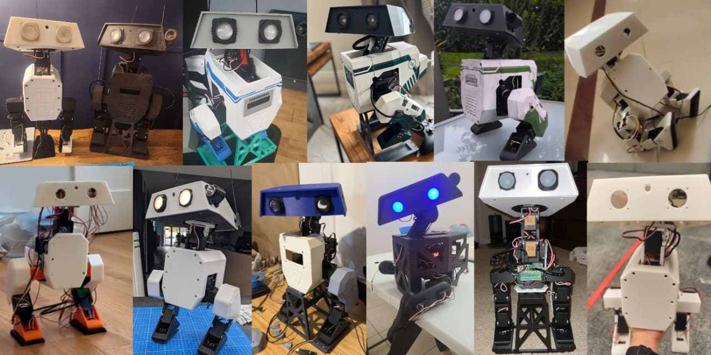
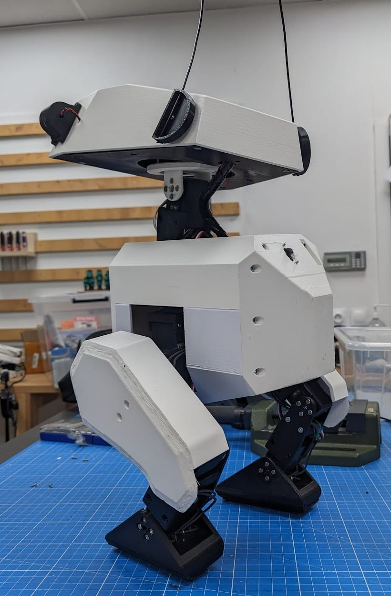
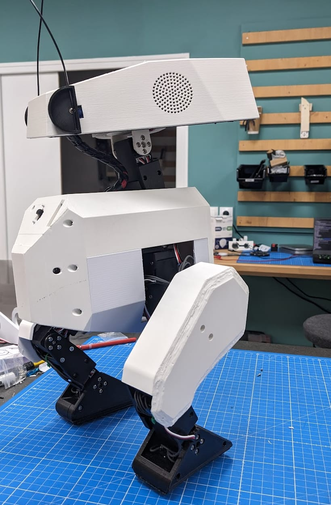
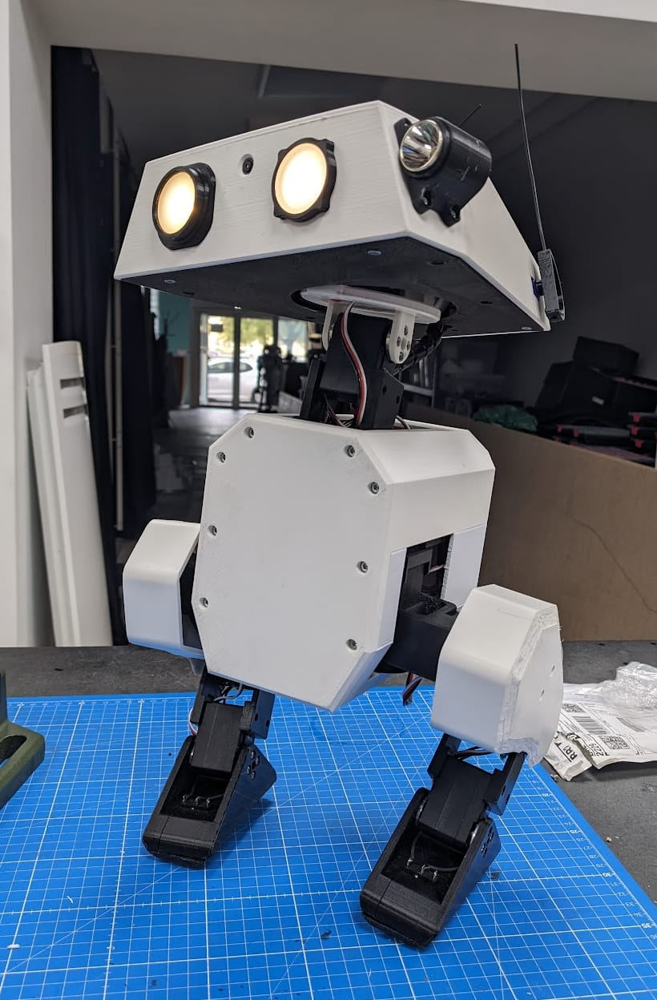

# Olaf Robotics
das
<p align="center">
  
</p>
<p align="center">
  <strong>Bringing an Animated Character to Life</strong>
</p>


<table>
  <tr>
    <td> </td>
    <td> </td>
   </tr> 
</table>

**Olaf Robotics** is an open-source project dedicated to bringing an animated character to life in the physical world. Our goal is to provide a compact, scale-accurate, and highly expressive robotic platform based on the Olaf character, as detailed in the research paper "Olaf: Bringing an Animated Character to Life in the Physical World".

# State of sim2real


<br>

<table>
  <tr>
    <td> </td>
    <td> </td>
   </tr> 
</table>
---

## 🌐 Multilingual Documentation / 文档 / Dokumentasi

- [English](#overview)
- [Bahasa Indonesia](#ringkasan)
- [中文 (Chinese)](#项目概述)

---

## Overview

Olaf Robotics is an open-source project dedicated to bringing an animated character to life in the physical world. Based on the Olaf character, it provides a compact, scale-accurate, and highly expressive robotic platform for research and development.

### 🏗️ Technical Architecture

Our architecture is built on a modular three-layer stack to ensure seamless sim-to-real transition:


1.  **Simulation Layer (Mujoco & RL)**:
    *   High-fidelity physics simulation using **MuJoCo**.
    *   Reinforcement Learning (RL) policies trained for robust bipedal locomotion.
    *   Domain randomization for improved sim-to-real transfer.
2.  **Control Layer (Walk Engine & IK)**:
    *   **Inverse Kinematics (IK)** solver for precise leg positioning.
    *   Parametric walk engine for stable gait generation.
    *   PID-based feedback loops for real-time balance correction.
3.  **Hardware Layer (Embedded)**:
    *   **Raspberry Pi Zero 2W** as the primary compute unit.
    *   High-torque micro servos for joint actuation.
    *   IMU-based orientation sensing for stabilization.

### 🛠️ Advanced Features

*   **Polyglot Core Engine**: High-performance components implemented in **C++17**, **C**, and **Rust** for real-time control, low-level communication, and sensor processing.
*   **CI/CD Pipeline**: Automated build and test workflows using GitHub Actions to ensure code stability across multiple languages.
*   **Multilingual Support**: Comprehensive documentation in English, Indonesian, and Chinese.
*   **Modular Design**: Decoupled simulation and hardware layers for rapid prototyping.

---

## Ringkasan

Olaf Robotics adalah proyek sumber terbuka yang didedikasikan untuk menghidupkan karakter animasi di dunia nyata. Berdasarkan karakter Olaf, proyek ini menyediakan platform robotik yang ringkas, akurat secara skala, dan sangat ekspresif.

### 🏗️ Arsitektur Teknis

Arsitektur kami dibangun di atas tumpukan tiga lapis modular untuk memastikan transisi sim-to-real yang mulus:

1.  **Lapisan Simulasi (Mujoco & RL)**: Simulasi fisika fidelitas tinggi menggunakan MuJoCo dan kebijakan Reinforcement Learning untuk lokomosi bipedal yang tangguh.
2.  **Lapisan Kontrol (Walk Engine & IK)**: Solver Kinematika Invers (IK) untuk pemosisian kaki yang presisi dan mesin jalan parametrik.
3.  **Lapisan Perangkat Keras (Embedded)**: Raspberry Pi Zero 2W sebagai unit komputasi utama dengan aktuasi servo mikro torsi tinggi.

---

## 项目概述

Olaf Robotics 是一个致力于将动画角色带入现实世界的开源项目。基于 Olaf 角色，它提供了一个紧凑、高度精确且极具表现力的机器人平台，供研究者和爱好者使用。

### 🏗️ 技术架构

我们的架构基于模块化的三层堆栈构建，以确保无缝的仿真到现实（sim-to-real）转换：

1.  **仿真层 (Mujoco & RL)**：使用 MuJoCo 进行高保真物理仿真，并训练强化学习 (RL) 策略以实现稳健的双足运动。
2.  **控制层 (Walk Engine & IK)**：用于精确腿部定位的反向运动学 (IK) 求解器和参数化步行引擎。
3.  **硬件层 (嵌入式)**：以 Raspberry Pi Zero 2W 为核心计算单元，配合高扭矩微型舵机进行关节驱动。

---

## Getting Started

### Hardware Assembly
Detailed assembly instructions can be found in the [Assembly Guide](docs/assembly_guide.md).

### Software Installation
To install the core library and dependencies:
```bash
pip install -e .
```

### Simulation
We use Mujoco for simulation. You can find the robot descriptions and simulation scripts in the `olaf_robotics/robots` and `experiments` directories.

## License
This project is licensed under the MIT License - see the [LICENSE](LICENSE) file for details.

---
*Project Goal: Bringing an Animated Character to Life.*
