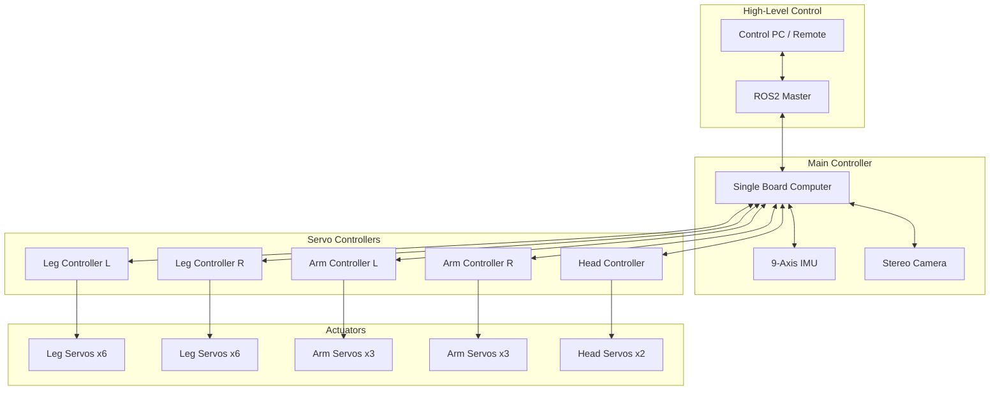

# ROBOVIE-Z Evolution
ew
<p align="center">
  
</p>

<p align="center">
  <strong>Full-Scale Humanoid Robot - Evolution from Robovie-Z Light</strong>
</p>

<<<<<<< HEAD
<p align="center">
  <a href="#overview">Overview</a> •
  <a href="#specifications">Specifications</a> •
  <a href="#evolution-comparison">Evolution</a> •
  <a href="#getting-started">Getting Started</a> •
  <a href="#documentation">Documentation</a>
</p>
=======
<<<<<<< HEADsa
### Advanced Two-Wheeled Self-Balancing Autonomous Robot

=======
>>>>>>> f8f0b53353144fcc6f9398bf255aed67341ad133
[](LICENSE)
[](https://python.org)
[](https://isocpp.org)
[](https://docs.ros.org/en/humble/)
[](https://PhantomRobot.github.io/phantom-robot)

**A cutting-edge platform demonstrating the seamless integration of physical hardware and Artificial Intelligence through real-time Digital Twin technology.**

[Overview](#overview) · [Key Technologies](#key-technologies) · [Physical Design](#physical-design) · [Demos](#demo-videos) · [Scenarios](#scenarios-plot) · [Metrics](#metrics-plot) · [Architecture](#system-architecture) · [Getting Started](#getting-started)
>>>>>>> b8f91a794952ae9624713bbef30eae5f32697bbe

---

## Overview

ROBOVIE-Z Evolution is a full-scale humanoid robot development project that is an evolution of Robovie-Z Light by Vstone. This project maintains the proportions and kinematic structure of the original robot, but with a larger scale and smooth futuristic armor.


### Key Features

| Feature | Description |
|---------|-------------|
| **Proportional Scaling** | Maintains the body proportion ratios of Robovie-Z Light |
| **Advanced Servo System** | High-torque servo motors for full-scale operation |
| **Futuristic Armor** | Smooth composite armor with seamless panels |
| **Modular Design** | Upgradable and replaceable components |
| **6-Axis IMU** | Stabilization with gyroscope and accelerometer |

### Video Demos

<table>
<tr>
<td align="center" width="33%">


**Arm Teleoperation**<br>
<sub>Real-time arm movement synchronization via motion capture suit and VR headset. Demonstrates precise servo control for upper body movements.</sub>

</td>
<td align="center" width="33%">


**Dual Arm Control**<br>
<sub>Simultaneous dual-arm movements from horizontal to overhead position. Shows coordinated 6-DOF arm control with smooth trajectory execution.</sub>

</td>
<td align="center" width="33%">


**Balance & Stability**<br>
<sub>One-legged balance demonstration with T-pose to single-leg stance. Highlights advanced 6-axis IMU stabilization and 12-DOF leg control.</sub>

</td>
</tr>
</table>

### Scenarios Plot

<table>
<tr>
<td align="center" width="33%">


**Walking Trajectory**<br>
<sub>3D CoM trajectory during bipedal walking gait. Shows lateral sway, vertical motion, and foot placement patterns.</sub>
</td>
<td align="center" width="33%">


**Running Trajectory**<br>
<sub>High-speed locomotion with flight phase. Demonstrates dynamic balance and increased step length.</sub>
</td>
<td align="center" width="33%">


**Kneeling-to-Standing**<br>
<sub>Joint angle profiles during transition phases. Hip, knee, and ankle coordination for stable motion.</sub>
</td>
</tr>
</table>

### Metrics Plot

<table>
<tr>
<td align="center" width="50%">


**Joint Tracking Error**<br>
<sub>Reference vs actual joint trajectories for hip, knee, ankle, and roll. Shows tracking accuracy during walking motion.</sub>
</td>
<td align="center" width="50%">


**Angular Velocity**<br>
<sub>Body roll, pitch, and yaw velocities during walking. Demonstrates IMU-based stabilization performance.</sub>
</td>
</tr>
<tr>
<td align="center" width="50%">


**Training Reward Curves**<br>
<sub>Policy learning progress for walking, running, and balance tasks. Converges to stable performance within 10K iterations.</sub>
</td>
<td align="center" width="50%">


**Benchmark: Success Rate**<br>
<sub>Motion success rates across different tasks. Walking (95.2%), Balance (98.1%), Arm Motion (96.8%).</sub>
</td>
</tr>
</table>

---

## Specifications

### Evolution Comparison

| Specification | Robovie-Z Light (Original) | ROBOVIE-Z Evolution (Full-Scale) |
|---------------|---------------------------|----------------------------------|
| **Height** | 315 mm | 1,575 mm (5x scale) |
| **Width** | 164 mm | 820 mm |
| **Depth** | 90 mm | 450 mm |
| **Weight** | 898 g | ~45 kg (estimated) |
| **DOF** | 20 axes | 20+ axes |
| **Power** | 6.6V LiFe 1000mAh | 48V Li-Ion system |

### Servo Motor Specifications

#### Original (Robovie-Z Light)
| Location | Model | Quantity |
|----------|-------|----------|
| Legs | VS-S055 | 12 |
| Arms & Head | VS-S055C (clutch) | 8 |
| **Total** | | **20 units** |

#### Evolution (Full-Scale)
| Location | Model | Quantity | Torque |
|----------|-------|----------|--------|
| Legs (Hip/Knee) | High-Torque Servo | 12 | 50+ kg.cm |
| Arms | Medium-Torque Servo | 6 | 25+ kg.cm |
| Head | Precision Servo | 2 | 10+ kg.cm |
| **Total** | | **20+ units** | |

### Degrees of Freedom (DOF)

```
                    HEAD (2 DOF)
                    ├── Pan (Yaw)
                    └── Tilt (Pitch)
                         │
            ┌────────────┼────────────┐
            │                         │
       LEFT ARM (3 DOF)          RIGHT ARM (3 DOF)
       ├── Shoulder Pitch        ├── Shoulder Pitch
       ├── Shoulder Roll         ├── Shoulder Roll
       └── Elbow                 └── Elbow
                         │
                    TORSO (0 DOF)
                         │
            ┌────────────┼────────────┐
            │                         │
       LEFT LEG (6 DOF)          RIGHT LEG (6 DOF)
       ├── Hip Yaw               ├── Hip Yaw
       ├── Hip Roll              ├── Hip Roll
       ├── Hip Pitch             ├── Hip Pitch
       ├── Knee Pitch            ├── Knee Pitch
       ├── Ankle Pitch           ├── Ankle Pitch
       └── Ankle Roll            └── Ankle Roll
```

**Total: 20 DOF** (same kinematic structure as original)

### Controller System

| Component | Original | Evolution |
|-----------|----------|-----------|
| Main Controller | VS-RC026 | Custom SBC (Raspberry Pi 5 / Jetson) |
| Communication | TTL Serial 115.2kbps | CAN Bus / RS-485 |
| Interface | USB Micro-B | USB-C, Ethernet, WiFi |
| Storage | 8GB microSD | 128GB+ SSD |
| OS | Proprietary | Linux (ROS2) |

### Sensor System

| Sensor | Original | Evolution |
|--------|----------|-----------|
| IMU | 6-axis (3-axis gyro + 3-axis accel) | 9-axis IMU (+ magnetometer) |
| Vision | None | Stereo camera / Depth sensor |
| Force/Torque | None | Foot pressure sensors |
| Audio | Speaker (mono) | Stereo speakers + microphones |

### Power System

| Specification | Original | Evolution |
|---------------|----------|-----------|
| Battery Type | LiFe 6.6V 1000mAh | Li-Ion 48V 10Ah+ |
| Runtime | ~30 min | ~60 min (estimated) |
| Charging | External charger | Onboard BMS |

---

## System Architecture



---

## Project Structure

```
ROBOVIE-Z/
├── docs/                       # Documentation
│   ├── assembly.md            # Assembly guide
│   ├── electronics.md         # Electronics setup
│   ├── calibration.md         # Servo calibration
│   └── troubleshooting.md     # Common issues
├── hardware/                   # Hardware designs
│   ├── servo/                 # Servo specifications
│   ├── controller/            # Controller schematics
│   ├── sensors/               # Sensor modules
│   ├── battery/               # Power system
│   └── frame/                 # Mechanical frame (CAD)
├── software/                   # Software stack
│   ├── firmware/              # Low-level firmware
│   ├── motion/                # Motion control
│   └── control/               # High-level control
├── media/                      # Visual assets
│   ├── images/                # Photos and renders
│   ├── diagrams/              # Technical diagrams
│   └── videos/                # Demo videos
├── configs/                    # Configuration files
├── tests/                      # Test scripts
├── legal/                      # Licenses
├── README.md                   # This file
└── LICENSE                     # Apache 2.0
```

---

## Getting Started

### Prerequisites

| Requirement | Version |
|-------------|---------|
| Python | 3.8+ |
| ROS2 | Humble / Iron |
| CMake | 3.16+ |

### Installation

```bash
# Clone repository
git clone https://github.com/popingle/phantom-robot.git
cd phantom-robot

# Install dependencies
pip install -r requirements.txt

# Build ROS2 workspace (if using ROS2)
colcon build
source install/setup.bash
```

### Quick Start

```bash
# Run simulation
python software/control/simulate.py

# Connect to real robot
python software/control/connect.py --port /dev/ttyUSB0
```

---

## Roadmap

- [ ] Complete CAD design for full-scale frame
- [ ] Servo motor selection and testing
- [ ] Controller PCB design
- [ ] Firmware development
- [ ] ROS2 integration
- [ ] Motion library porting from Robovie-Z Light
- [ ] Walking gait optimization
- [ ] Autonomous navigation

---

## Documentation

| Category | Description |
|----------|-------------|
| [Assembly Guide](docs/assembly.md) | Step-by-step assembly instructions |
| [Electronics Setup](docs/electronics.md) | Wiring and connections |
| [Calibration](docs/calibration.md) | Servo calibration procedures |
| [Troubleshooting](docs/troubleshooting.md) | Common issues and solutions |

---

## References

### Original Robot
- **Robovie-Z Light** by Vstone Co., Ltd.
- Product Page: [Vstone Robotshop](https://www.vstone.co.jp/robotshop/index.php?main_page=product_info&cPath=70_947&products_id=5393)

### Inspired By
- [Phantom Robot](https://github.com/popingle/phantom-robot.git) - Documentation structure reference

---

## License

This project is licensed under the Apache License 2.0 - see the [LICENSE](LICENSE) file for details.

---

## Acknowledgments

- **Vstone Co., Ltd.** - Original Robovie-Z Light design
- **Open Source Robotics Community** - ROS2 and related tools

---

<p align="center">
  <strong>ROBOVIE-Z Evolution</strong><br>
  <em>From Mini to Mighty - Same Proportions, Bigger Dreams</em>
</p>
