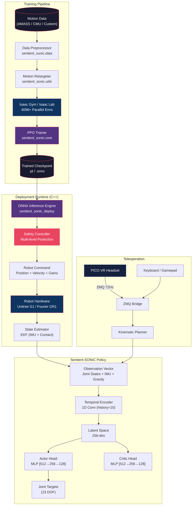
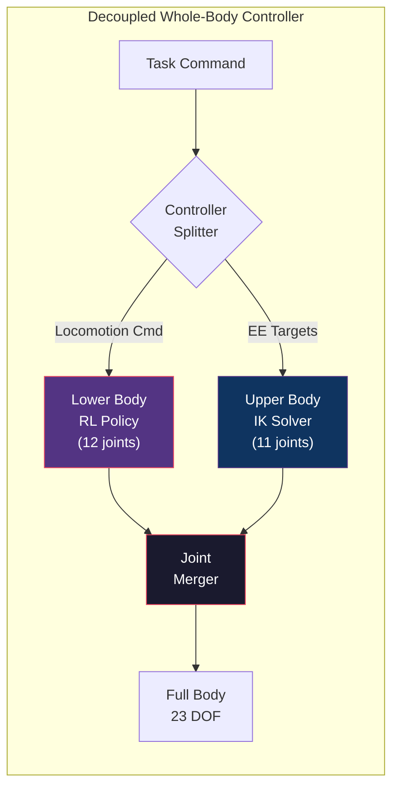

<div align="center">


# SENTIENT ROBOTICS


### Advanced Humanoid Whole-Body Control Platform

[](LICENSE)
[](https://python.org)
[](https://isocpp.org)
[](https://onnxruntime.ai)
[](https://arxiv.org/abs/2511.07820)
[](https://blackdragonspear62.github.io/sentient-robotics)

**Unified platform for developing and deploying generalist humanoid whole-body controllers.**

[Getting Started](#getting-started) · [Architecture](#system-architecture) · [Sentient-SONIC](#sentient-sonic) · [Scenarios](#scenarios-plot) · [Metrics](#metrics-plot) · [Documentation](#documentation) · [Citation](#citation)

---

</div>

## Overview

**Sentient Robotics** is a unified platform for developing and deploying advanced humanoid whole-body controllers. It hosts model checkpoints and scripts for training, evaluating, and deploying controllers that enable humanoid robots to perform natural, whole-body movements — from walking and crawling to teleoperation and multi-modal control.

<div align="center">
  <table border="0">
    <tr>
      <td width="33%"></td>
      <td width="33%"></td>
      <td width="33%"></td>
    </tr>
  </table>
</div>

This platform currently supports:

| Module | Description | Status |
|--------|-------------|--------|
| **Sentient-SONIC** | Generalist humanoid behavior foundation model trained on large-scale human motion data | Active |
| **Decoupled WBC** | Decoupled controller (RL lower body + IK upper body) used in N1.5 and N1.6 models | Stable |
| **C++ Deploy Stack** | High-performance ONNX inference runtime for real hardware deployment | Active |
| **VR Teleoperation** | Real-time whole-body teleoperation via PICO VR headset | Active |

---

## System Architecture



### Decoupled WBC Architecture



---

## Sentient-SONIC

**Sentient-SONIC** is a humanoid behavior foundation model that gives robots a core set of motor skills learned from large-scale human motion data. Rather than building separate controllers for predefined motions, Sentient-SONIC uses motion tracking as a scalable training task, enabling a single unified policy to produce natural, whole-body movement and support a wide range of behaviors.

### Capabilities

<table>
<tr>
<td align="center"><b>Walking</b></td>
<td align="center"><b>Running</b></td>
<td align="center"><b>Sideways Movement</b></td>
<td align="center"><b>Kneeling</b></td>
</tr>
<tr>
<td align="center"><b>Getting Up</b></td>
<td align="center"><b>Jumping</b></td>
<td align="center"><b>Bimanual Manipulation</b></td>
<td align="center"><b>Object Hand-off</b></td>
</tr>
</table>

### Kinematic Planner

Sentient-SONIC includes a kinematic planner for real-time locomotion generation — choose a movement style, steer with keyboard/gamepad, and adjust speed and height on the fly.

| Style | Description |
|-------|-------------|
| Walk | Natural bipedal walking |
| Run | High-speed locomotion |
| Happy | Expressive joyful movement |
| Stealth | Low-profile sneaking |
| Injured | Limping / asymmetric gait |
| Kneeling | Ground-level locomotion |
| Hand Crawling | Quadruped-style crawling |
| Elbow Crawling | Military-style low crawl |
| Boxing | Combat-ready stance and movement |

### VR Whole-Body Teleoperation

Sentient-SONIC supports real-time whole-body teleoperation via PICO VR headset, enabling natural human-to-robot motion transfer for data collection and interactive control.

---

## Scenarios Plot

The following 3D trajectory plots show reference motion clips (blue) versus Sentient-SONIC policy output (red) across different locomotion scenarios. Start and end points are annotated with coordinates.

### Walking Trajectory

<div align="center">

</div>

> Natural bipedal walking with sinusoidal lateral sway. The policy closely tracks the reference trajectory with minimal drift across 3.77 m of forward locomotion.

### Running Trajectory

<div align="center">

</div>

> High-speed running with increased foot clearance and larger stride length. The policy maintains tracking fidelity even at elevated velocities over 11+ meters.

### Kneeling-to-Standing Transition

<div align="center">

</div>

> Vertical center-of-mass trajectory during kneeling-to-standing transitions. The policy accurately reproduces the height profile with minimal XY drift.

---

## Metrics Plot

Detailed performance metrics from policy evaluation on held-out motion clips.

### Joint Tracking Error

<div align="center">

</div>

> Position and velocity tracking errors converge to near-zero within the first 5 seconds of each episode, demonstrating rapid adaptation and stable control.

### Base Angular Velocity & CoM Height

<div align="center">

</div>

> The base angular velocity converges from 0.18 rad/s to near-zero within 4 seconds. Center-of-mass height stabilizes within the tolerance band around the 0.75 m target.

### Training Reward Curves

<div align="center">

</div>

> Reward components during Sentient-SONIC Base training. Total reward saturates around 0.85, with position tracking contributing the largest share.

### Benchmark: Success Rate by Motion Style

<div align="center">

</div>

> Sentient-SONIC consistently outperforms the Decoupled WBC baseline across all 11 motion styles, achieving 97.2% on walking and maintaining >70% even on challenging motions like jumping.

---

## What's Included

```
sentient-robotics/
├── sentient_sonic/              # Sentient-SONIC Python package
│   ├── core/                    #   Policy, network, trainer, reward, config
│   ├── teleop/                  #   VR, keyboard, gamepad controllers
│   ├── utils/                   #   Transforms, ZMQ, robot defs, retargeting
│   ├── configs/                 #   Training, deployment, teleop YAML configs
│   └── data/                    #   Data preprocessing and loading
├── sentient_sonic_deploy/       # C++ deployment stack
│   ├── include/sentient_sonic/  #   Header files (inference, safety, robot, state)
│   ├── src/                     #   Implementation files
│   └── CMakeLists.txt           #   Build configuration
├── decoupled_wbc/               # Decoupled WBC (RL lower + IK upper)
├── docs/                        # Full documentation (13 pages)
├── tests/                       # Comprehensive test suite (8 test files)
├── external_dependencies/       # Dependency build scripts
├── install_scripts/             # Installation helpers
├── legal/                       # License, NOTICE, third-party attributions
├── media/                       # Visual assets and demos
├── pyproject.toml               # Python package configuration
├── Makefile                     # Build system entry point
├── CITATION.cff                 # Citation metadata
└── LICENSE                      # Dual license (Apache 2.0 + NVIDIA OML)
```

---

## Getting Started

### Prerequisites

| Requirement | Version |
|-------------|---------|
| Python | 3.8+ |
| CUDA | 11.8+ (GPU training only) |
| Git LFS | Latest |
| CMake | 3.16+ (C++ deployment only) |

### Installation


```bash
# Clone with Git LFS
git clone https://github.com/blackdragonspear62/sentient-robotics.git
cd sentient-robotics
git lfs pull

# Install Python package
pip install -e .

# With all optional dependencies
pip install -e ".[dev,deploy,teleop]"
```

### Quick Start

```python
from sentient_sonic import SonicPolicy, SonicConfig

# Configure and load policy
config = SonicConfig(model_name="sentient-sonic-base", device="cuda:0")
policy = SonicPolicy(config=config, checkpoint_path="checkpoints/sentient-sonic-base/policy.pt")
policy.load()

# Run inference
observation = get_robot_observation()  # Your robot state
output = policy.infer(observation)
send_to_robot(output.joint_positions)  # Send to hardware
```

### Deploy on Real Hardware

```bash
# Build C++ deployment stack
cd sentient_sonic_deploy && mkdir build && cd build
cmake .. -DONNXRUNTIME_ROOT=/opt/onnxruntime
make -j$(nproc)

# Deploy on Unitree G1
./sentient_deploy checkpoints/policy.onnx 192.168.1.100 8080
```

### Download Pretrained Checkpoints

```bash
python download_from_hf.py --model sentient-sonic-base
```

---

## Roadmap

- [x] Release pretrained Sentient-SONIC policy checkpoints
- [x] Open source C++ inference stack
- [x] Setup documentation
- [x] Open source teleoperation stack and demonstration scripts
- [ ] Release training scripts and recipes for motion imitation and fine-tuning
- [ ] Open source large-scale data collection workflows and fine-tuning VLA scripts
- [ ] Publish additional preprocessed large-scale human motion datasets

---

## Documentation

### Getting Started

| Guide | Description |
|-------|-------------|
| [Installation Guide](docs/installation.md) | Setup and installation instructions |
| [Quick Start](docs/quickstart.md) | Get running in 5 minutes |
| [VR Teleoperation Setup](docs/vr_teleop.md) | PICO VR configuration |

### Tutorials

| Tutorial | Description |
|----------|-------------|
| [Keyboard Control](docs/keyboard_control.md) | Control humanoid with keyboard |
| [Gamepad Control](docs/gamepad_control.md) | Control humanoid with gamepad |
| [ZMQ Communication](docs/zmq_comm.md) | Inter-process communication setup |
| [Deployment Guide](docs/deployment.md) | Deploy on real hardware |
| [Training Guide](docs/training.md) | Train your own policy |

### Reference

| Document | Description |
|----------|-------------|
| [SONIC Overview](docs/sonic_overview.md) | Architecture and design |
| [Decoupled WBC](docs/decoupled_wbc.md) | Decoupled controller docs |
| [API Reference](docs/api_reference.md) | Full API documentation |

---

## Citation

If you use Sentient-SONIC in your research, please cite:

```bibtex
@article{luo2025sonic,
    title={SONIC: Supersizing Motion Tracking for Natural Humanoid Whole-Body Control},
    author={Luo, Zhengyi and Yuan, Ye and Wang, Tingwu and Li, Chenran and Chen, Sirui and Casta\~neda, Fernando and Cao, Zi-Ang and Li, Jiefeng and Minor, David and Ben, Qingwei and Da, Xingye and Ding, Runyu and Hogg, Cyrus and Song, Lina and Lim, Edy and Jeong, Eugene and He, Tairan and Xue, Haoru and Xiao, Wenli and Wang, Zi and Yuen, Simon and Kautz, Jan and Chang, Yan and Iqbal, Umar and Fan, Linxi and Zhu, Yuke},
    journal={arXiv preprint arXiv:2511.07820},
    year={2025}
}
```

---

## License

This project uses dual licensing:

| Component | License |
|-----------|---------|
| **Source Code** | [Apache License 2.0](LICENSE) |
| **Model Weights** | [NVIDIA Open Model License](LICENSE) |

Please review both licenses before using this project. The NVIDIA Open Model License permits commercial use with attribution and requires compliance with NVIDIA's Trustworthy AI terms.

All required legal documents, including the Apache 2.0 license, 3rd-party attributions, and DCO language, are consolidated in the [`/legal`](legal/) folder.

---

## Support

For questions and issues, please [open an issue](https://github.com/blackdragonspear62/sentient-robotics/issues) or contact the Sentient Robotics team.

---

## Acknowledgments

This project is built upon the foundational work of [GR00T-WholeBodyControl](https://github.com/NVlabs/GR00T-WholeBodyControl) by NVIDIA (NVlabs), licensed under Apache 2.0. We gratefully acknowledge their contributions to the humanoid robotics community.

We would also like to acknowledge the following projects from which parts of the code are derived:

- [Beyond Mimic](https://github.com/blackdragonspear62/PHC)
- [Isaac Lab](https://github.com/isaac-sim/IsaacLab)

<div align="center">

---

**Sentient Robotics** — *Advancing the frontier of humanoid intelligence.*


</div>
